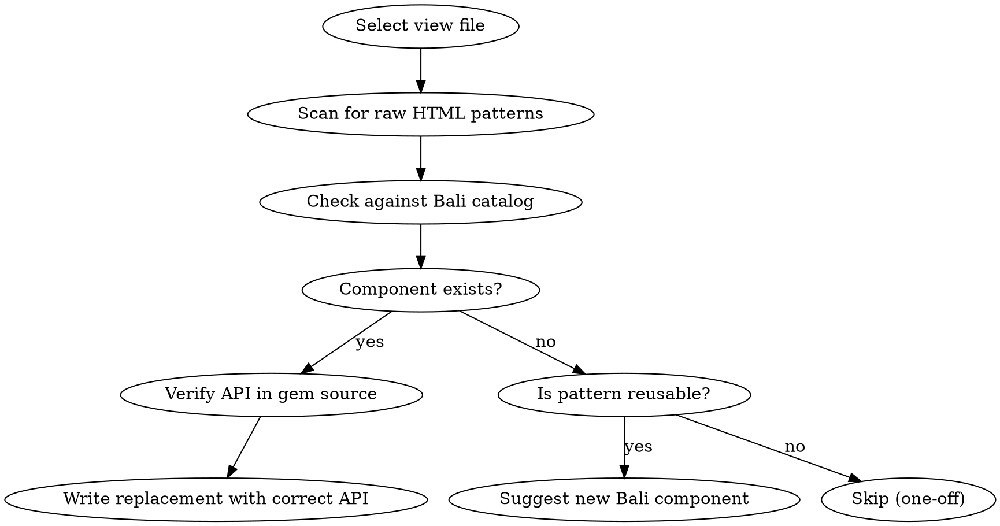

# Bali View Audit

Systematic review of Rails views to maximize Bali ViewComponent usage and identify missing components.

## Overview

This skill audits ERB views to find:
1. Raw HTML that should use existing Bali components
2. Repeated patterns that could become new Bali components
3. Incorrect Bali component API usage

**CRITICAL:** Always verify component APIs before suggesting changes. Use the `bali-components` skill for API reference.

## Audit Process



## Pattern Detection Checklist

### High-Value Replacements (check first)

| Raw HTML Pattern | Bali Component | Priority |
|------------------|----------------|----------|
| `<dl><dt>...<dd>...` (definition lists) | `Bali::PropertiesTable::Component` | HIGH |
| `<div class="flex justify-between">` with h1 + actions | `Bali::PageHeader::Component` | HIGH |
| `<table class="table">` | `Bali::Table::Component` | HIGH |
| `<ul class="menu">` or custom lists | `Bali::List::Component` | MEDIUM |
| `<h2 class="card-title">` inside Card | Card's `with_title()` slot | MEDIUM |
| Manual true/false rendering | `Bali::BooleanIcon::Component` | LOW |

### Common Anti-Patterns (ALWAYS check for these)

| Anti-Pattern | Correct Usage | How to Find |
|--------------|---------------|-------------|
| `Link.new(type: :ghost)` | `Link.new(variant: :ghost)` | Grep for `type:` in Link renders |
| `card.with_body { }` | Content goes directly in block | Grep for `with_body` |
| `card.with_footer { }` | Use `card.with_action { }` for each action | Grep for `with_footer` |
| `modal.with_footer { }` | Use `modal.with_actions { }` | Grep for `with_footer` |
| `modal.with_header { "Title" }` | `modal.with_header(title: "Title")` | Check header slot usage |

**CRITICAL:** Scan for deprecated `type:` parameter in ALL `Bali::Link::Component` usages. This is a common mistake that silently fails.

## API Verification (MANDATORY)

**Before suggesting ANY component replacement:**

1. Read the component's `.rb` file to check:
   - `initialize` parameters
   - `renders_one` / `renders_many` slots
   - Constant hashes (VARIANTS, SIZES, etc.)

2. Read the component's `.html.erb` to understand:
   - How slots are rendered
   - What content goes where

**Gem location pattern:**
```
vendor/bundle/ruby/*/bundler/gems/bali-view-components-*/app/components/bali/[name]/
```

## Output Format

For each finding, provide:

```markdown
### [Priority: HIGH/MEDIUM/LOW] [Description]

**File:** `path/to/view.html.erb` (lines X-Y)

**Current:**
```erb
[current code]
```

**Suggested:**
```erb
[replacement using Bali component]
```

**API verified:** [component.rb line showing slot/param]
```

## Suggesting New Bali Components

Only suggest new components when:
1. Pattern appears 3+ times across views
2. Pattern has clear abstraction (not project-specific)
3. Pattern would benefit other AFAL projects

**Format for new component suggestions:**

```markdown
### NEW COMPONENT: Bali::[Name]::Component

**Pattern found in:**
- `app/views/foo/index.html.erb` (lines 10-20)
- `app/views/bar/show.html.erb` (lines 5-15)

**Proposed API:**
```ruby
Bali::[Name]::Component.new(
  param1: value,
  param2: value
)
```

**Rationale:** [Why this deserves to be a component]
```

## Priority Levels

| Priority | Criteria | Action |
|----------|----------|--------|
| **HIGH** | Structural (tables, layouts, page headers) | Fix immediately |
| **MEDIUM** | Repeated UI patterns (lists, cards) | Fix in current PR |
| **LOW** | Cosmetic improvements | Track for later |

## Red Flags - STOP and Verify

These thoughts mean you're about to make a mistake:

| Thought | Reality |
|---------|---------|
| "This component probably has X slot" | READ THE SOURCE. Probably ≠ definitely. |
| "The API is similar to DaisyUI" | Bali wraps DaisyUI but has its own API. |
| "I'll suggest the obvious replacement" | Obvious replacements often use wrong API. |
| "The handbook says X" | Handbook may be outdated. Gem source is truth. |

## Integration with bali-components Skill

After identifying replacements, invoke `bali-components` skill for:
- Correct slot names and parameters
- Common mistakes to avoid
- Form builder patterns (not ViewComponents)

## Example Audit Output

### [HIGH] Definition list should use PropertiesTable

**File:** `app/views/legal_entities/show.html.erb` (lines 24-43)

**Current:**
```erb
<dl class="mt-4 space-y-4">
  <div>
    <dt class="text-sm text-base-content/60"><%= LegalEntity.human_attribute_name(:name) %></dt>
    <dd class="font-medium"><%= @legal_entity.name %></dd>
  </div>
  ...
</dl>
```

**Suggested:**
```erb
<%= render Bali::PropertiesTable::Component.new do |table| %>
  <% table.with_property(label: LegalEntity.human_attribute_name(:name), value: @legal_entity.name) %>
  <% table.with_property(label: LegalEntity.human_attribute_name(:rfc)) do %>
    <span class="font-mono"><%= @legal_entity.rfc %></span>
  <% end %>
  <% table.with_property(label: LegalEntity.human_attribute_name(:active)) do %>
    <%= render Bali::Tag::Component.new(
      text: @legal_entity.active? ? t('.status_active') : t('.status_inactive'),
      color: @legal_entity.active? ? :success : :error,
      size: :sm
    ) %>
  <% end %>
<% end %>
```

**API verified:** `PropertiesTable::Property::Component.new(label:, value:)` accepts block for complex content.
